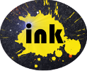

# ink-collector #

Part of the **ink** tool suite

**ink-collector** is a collection manager. Given an array or hash table (an object where each key represents a record), you can
query and manipulat the results in a number of different ways. For instance, if you have a collection that contains records that
look like this:

	{
		name: {
			first: "Gloria",
			name: "Swanson"
		},
		work: {
			company: "ABC Deliveries",
			city: "Philadelphia"
		},
		purchases: 389.75
	}

When you collect it using **ink-collector** you can do some neat things

	var collector = require("ink-collector")
	// get data from somewhere
	var people = collector.collect( myCollection );

	// find all people with a last name of Swanson:
	var swansons = people.find({"name.last": "swanson"});

	// all Swansons in Chicago
	var chigSwansons = people.find({"name.last": "swanson", "work.city": "Chicago"});

	// all Swansons in Chicago with purchases greater than 1000
    var chigSwansons = people.find({"name.last": "swanson", "work.city": "Chicago", "purchases": {$gt:1000}});

As you can see, the query language is the Mongo query language - indeed,
[it supports pretty nice subset of Mongo's language](http://terryweiss.github.io/ink-probe/probe.queryOperators.html)
along with dot notation to support reaching into objects.

It also supports a number of useful methods from the underscore/lodash world:

	people.each(function(row, key)){
		console.info(row.name.first);
	});

	// OK, nice. But what if I only want to iterate the Swansons of the world?
	people.each(function(row, key)){
        console.info({"name.last": "swanson"}, row.name.first);
    });

	// group only the members of company ABC by city
    var groupings = people.groupBy( {"work.company" : "ABC"}, function ( row ) {
        return row.work.city;
    } );

	// count by? you betcha
    // group only the members of company ABC by city
    var countBy = people.countBy( {"work.company" : "ABC"}, function ( row ) {
        return row.work.city;
    } );

And a all the goodness you would expect like `max`, `min`, `map`, `reduce` and others. See the documentation for full juicy details.

## Usage ##
From node:
	var strings = require("ink-collector");

On the web:
Copy `dist/ink.collector.js` or `dist/ink.collector.min.js` to your assets directory and then load it directly

	
	

The collector supports arrays and objects. It provides three methods to get you on your way. It manages arrays and objects slightly differently
since some actions only make sense on an array. Most of the time you will want to use `collect`

	var hookMeUp = collector.collect(someCollection);

If you don't pass a collection to `collect` it will default to an object collector. If you pass a value, it interrogates the value
and returns an array or object collector as appropriate. If you need more control, you can call:

	// creates an array collector
	var myCollection = collector.array();
	// creates an array collector
	var myCollection = collector.object();

What you actually receive is an instance of either `ACollector` or `OCollector`, however these classes are not exposed directly - you
can't instantiate these classes directly. That may change in a future release, but for now consider this module a factory that returns
product instances without revealing the implementation details.

## Contributing ##
Yes! Contribute. Make sure your code looks essentially like the code you see. Document using JSDoc tags.

Make sure you have [grunt-cli](https://github.com/gruntjs/grunt-cli) installed globally. To test, you will also need
[nodeunit](https://github.com/caolan/nodeunit) installed globally. To test:

	nodeunit tests/

## ink tools ##
Also see

+ [ink-probe](https://github.com/terryweiss/ink-probe)
+ [ink-strings](https://github.com/terryweiss/ink-strings)
+ ink-collector (https://github.com/terryweiss/ink-collector)
+ ink-scene (coming soon)
+ ink-dox (coming, but a long way off yet)

## License ##
Permission is hereby granted, free of charge, to any person
obtaining a copy of this software and associated documentation
files (the "Software"), to deal in the Software without
restriction, including without limitation the rights to use,
copy, modify, merge, publish, distribute, sublicense, and/or sell
copies of the Software, and to permit persons to whom the
Software is furnished to do so, subject to the following
conditions:

The above copyright notice and this permission notice shall be
included in all copies or substantial portions of the Software.

THE SOFTWARE IS PROVIDED "AS IS", WITHOUT WARRANTY OF ANY KIND,
EXPRESS OR IMPLIED, INCLUDING BUT NOT LIMITED TO THE WARRANTIES
OF MERCHANTABILITY, FITNESS FOR A PARTICULAR PURPOSE AND
NONINFRINGEMENT. IN NO EVENT SHALL THE AUTHORS OR COPYRIGHT
HOLDERS BE LIABLE FOR ANY CLAIM, DAMAGES OR OTHER LIABILITY,
WHETHER IN AN ACTION OF CONTRACT, TORT OR OTHERWISE, ARISING
FROM, OUT OF OR IN CONNECTION WITH THE SOFTWARE OR THE USE OR
OTHER DEALINGS IN THE SOFTWARE.
